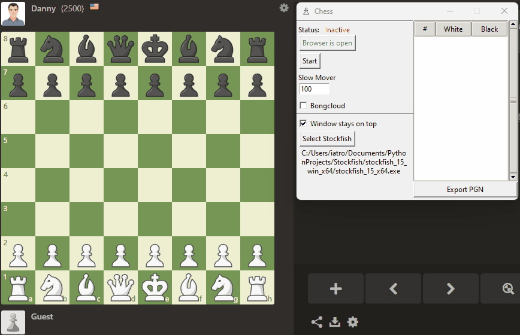

# chess-auto-bot
A bot for chess.com that automatically plays chess for you  

## How to install
1) Clone the repository or just download the repository as a .zip
2) Download Stockfish from https://stockfishchess.org/
3) `cd chess-auto-bot`
4) Windows: `python -m venv venv`  
   Linux: `python3 -m venv venv`
5) Windows: `venv\Scripts\pip.exe install -r requirements.txt`  
   Linux: `venv/bin/pip3 install -r requirements.txt`

## How to use
1) Open a Terminal
2) `cd chess-auto-bot`
3) Windows: `venv\Scripts\python.exe gui.py`  
   Linux: `venv/bin/python3 gui.py`
4) Click Select Stockfish on the GUI that opens. This will open a file explorer. Navigate to the folder where you downloaded Stockfish and select the Stockfish executable.
5) Click Open Browser. This will open ChromeDriver and load the chess.com website.
6) Navigate to a live match (online or vs bot)
7) Click Start
8) Enjoy

## Currently supports
- Windows/Linux platforms
- Playing vs humans
- Playing vs bots
- Bongcloud mode ( ͡° ͜ʖ ͡° )
- Slow Mover option (defaults to 100, 10 &le; Slow Mover &le; 1000)  
  lower values will make Stockfish take less time in games, higher values will make it think longer
- Exporting finished games to PGN

## Disclaimer
Under no circumstances should you use this bot to cheat in online games or tournaments. This bot was made for educational purposes only.
Using this bot to cheat in online games or tournaments is against the rules of chess.com and will result in a ban.
